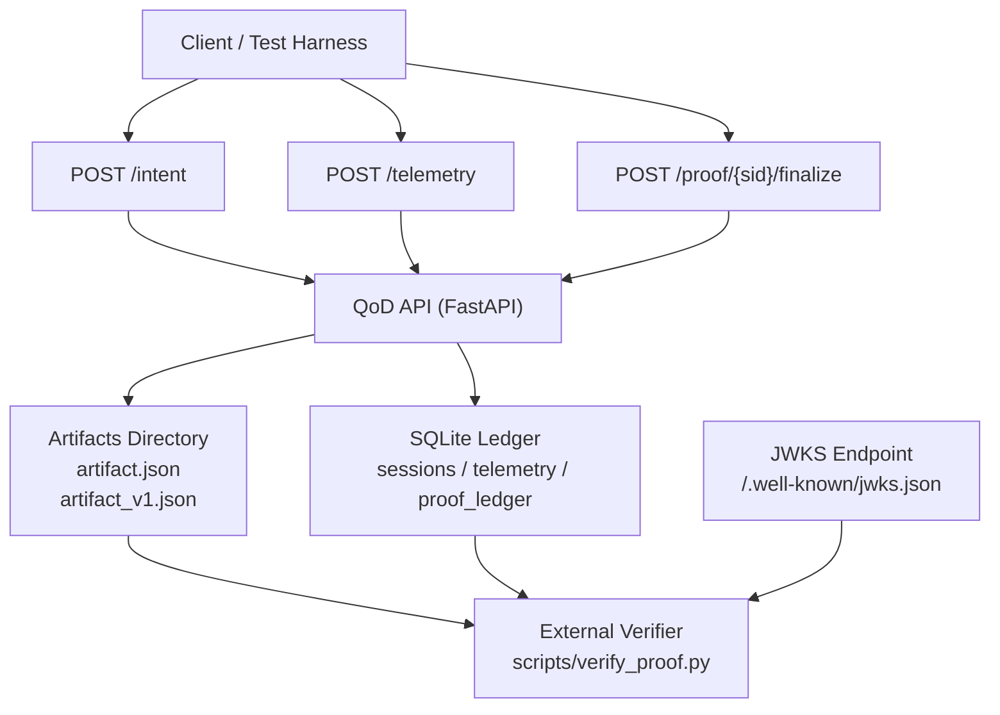

# QoD Mock (qod-mock) — v0.4

A verifiable Quality-on-Demand (QoD) proof service that produces cryptographically signed telemetry artifacts and allows independent verification using public keys published via JWKS.

The system demonstrates how network or service performance claims can be tamper-evident and externally verifiable.

--------------------------------------------------

ARCHITECTURE DIAGRAM
## Architecture Diagram

--------------------------------------------------

QUICK DEMO (LOCAL)

Start the API

python -m uvicorn backend.main:app --reload --port 8000

Generate a proof end-to-end

PowerShell example:

$intent = @{
  text="demo"
  target_p95_latency_ms=100
  target_jitter_ms=20
  duration_s=30
  flow_label="readme-demo"
} | ConvertTo-Json

$r = Invoke-RestMethod -Method POST http://localhost:8000/intent -ContentType "application/json" -Body $intent
$sid = $r.session_id

$telemetry = @{
  session_id = $sid
  n = 200
  p50_ms = 40
  p95_ms = 80
  jitter_ms = 10
  notes = "readme demo"
} | ConvertTo-Json

Invoke-RestMethod -Method POST http://localhost:8000/telemetry -ContentType "application/json" -Body $telemetry
Invoke-RestMethod -Method POST "http://localhost:8000/proof/$sid/finalize" | Out-Null

Invoke-RestMethod "http://localhost:8000/proof/$sid/verify"

Independent verification

python scripts/verify_proof.py http://localhost:8000 <session_id>

--------------------------------------------------

WHAT THIS PROJECT IS

This repository is a QoD proof service plus verification harness.

It allows you to:

• Create a QoD intent describing desired network performance  
• Submit telemetry measurements  
• Produce a cryptographically signed proof record  
• Generate deterministic runtime artifacts  
• Verify results independently using public keys  

Verification layers include:

• runtime artifact hashing  
• ledger hash chaining  
• Ed25519 signatures  
• public key discovery via JWKS  

The design goal is reproducibility and independent verification.

A clean environment should be able to run the project and produce the same artifact structure and validation results.

--------------------------------------------------

ARCHITECTURE (HIGH LEVEL)

Client / Test Harness

POST /intent  
POST /telemetry  
POST /proof/{sid}/finalize  

↓

QoD API (FastAPI)

writes:

• SQLite rows (sessions / telemetry / proof_ledger)  
• runtime artifact JSON  
• wrapper artifact JSON  
• proof snapshot JSON  

↓

Artifacts + Ledger

independent verification:

• ledger hash recompute  
• runtime artifact hash recompute  
• signature verification  
• public key discovery via JWKS  

↓

External Verifier

scripts/verify_proof.py

--------------------------------------------------

INPUTS / OUTPUTS / SUCCESS CRITERIA

Purpose

Take a user performance request plus telemetry measurements and produce a deterministic artifact that downstream systems can consume while allowing third parties to verify results without trusting the service.

--------------------------------------------------

INPUTS

Accepted input format:

JSON HTTP requests to API endpoints.

Core API flow

1. POST /intent  
Create a QoD session based on requested targets

2. POST /telemetry  
Submit performance measurements for that session

3. POST /proof/{session_id}/finalize  
Generate a signed proof and write artifacts

4. GET /proof/{session_id}  
Fetch proof record

5. GET /proof/{session_id}/verify  
Verify hashes, chain integrity, and signatures

--------------------------------------------------

OUTPUTS

Artifacts are written to the artifacts/ directory.

Runtime artifact

artifacts/{session_id}/artifact.json

Structured JSON describing measured outcomes and pass/fail decision.

Wrapper artifact

artifacts/{session_id}/artifact_v1.json

Run output wrapper containing proof metadata.

Proof snapshot

artifacts/proof_{session_id}_YYYYMMDD_HHMMSS.json

Contains:

prev_hash  
this_hash  
signature  
kid  
proof  

Run summary

artifacts/run_summaries/run_YYYYMMDD_HHMMSS_{session_id}.json

Contains execution metadata and artifact locations.

--------------------------------------------------

TAMPER-EVIDENT PROOF DESIGN

Each proof includes multiple layers of integrity verification.

1. Runtime artifact hash

The proof record stores:

runtime_artifact_sha256

The verifier recomputes the hash of:

artifacts/{sid}/artifact.json

2. Ledger hash chain

Each proof entry stores:

prev_hash  
this_hash  

Hash calculation:

this_hash = sha256(prev_hash + "|" + canonical_json(proof))

This creates a tamper-evident chain of proofs.

3. Ed25519 signature

The service signs this_hash.

Stored fields:

signature  
kid  

The verifier:

1. fetches the public key  
2. verifies the signature  
3. confirms integrity  

--------------------------------------------------

PUBLIC KEY DISCOVERY

External verifiers discover signing keys via JWKS.

Standard JWKS endpoint

GET /.well-known/jwks.json

Example

curl http://localhost:8000/.well-known/jwks.json

Example response

{
  "keys": [
    {
      "kty": "OKP",
      "crv": "Ed25519",
      "kid": "default",
      "alg": "EdDSA",
      "use": "sig",
      "x": "PUBLIC_KEY_BASE64URL"
    }
  ]
}

Human-friendly endpoint

GET /public-keys

Returns a simplified list of verification keys.

--------------------------------------------------

API INVENTORY

Maintaining an explicit API inventory helps prevent undocumented endpoints and aligns with OWASP API security guidance.

Endpoint — Method — Purpose

/health — GET — Liveness check  
/ready — GET — Readiness check  
/intent — POST — Create QoD session  
/telemetry — POST — Submit telemetry samples  
/proof/{session_id}/finalize — POST — Generate signed proof  
/proof/{session_id} — GET — Fetch proof record  
/proof/{session_id}/bundle — GET — Retrieve proof and runtime artifact  
/proof/{session_id}/verify — GET — Verify proof integrity  
/.well-known/jwks.json — GET — Publish public verification keys  
/public-keys — GET — Human-readable key listing  

--------------------------------------------------

SECURITY PROPERTIES

The system provides:

• tamper-evident artifact storage  
• cryptographic proof signatures  
• independent verification capability  
• deterministic artifact generation  
• public key discovery via JWKS  

These properties make proof records auditable and externally verifiable.

--------------------------------------------------

VERIFICATION MODEL

A third party can verify proofs without trusting the service.

Steps:

1. Fetch proof bundle  
2. Fetch JWKS public keys  
3. Verify Ed25519 signature  
4. Recompute ledger hash  
5. Recompute runtime artifact hash  

If all checks pass, the proof is valid.

--------------------------------------------------

PROJECT GOALS

This project demonstrates how to build a verifiable telemetry protocol.

Potential use cases include:

• telecom network SLA verification  
• cloud service performance proofs  
• infrastructure auditing  
• reproducible telemetry pipelines  
• compliance evidence systems  

--------------------------------------------------

VERSION

Current version

v0.4

Major additions in v0.4

• Ed25519 proof signatures  
• JWKS public key discovery  
• key rotation support  
• proof verification endpoint  
• independent verifier script  
• end-to-end demo flow