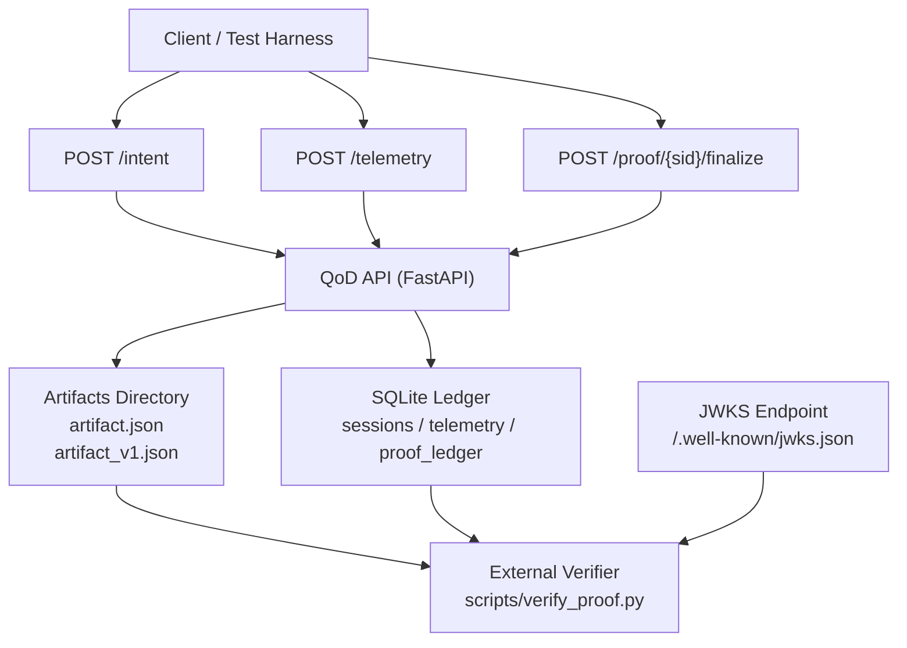

# QoD Mock (qod-mock) — v0.4

A verifiable Quality-on-Demand (QoD) proof service that produces cryptographically signed telemetry artifacts and allows independent verification using public keys published via JWKS.

The system demonstrates how network or service performance claims can be tamper-evident and externally verifiable.

--------------------------------------------------

ARCHITECTURE DIAGRAM
## Architecture Diagram

--------------------------------------------------

# QoD Mock (qod-mock) — v0.4

---

# What this project is

This repository is a **Quality-on-Demand (QoD) proof service + verification harness**.

It simulates a telecom QoD workflow and produces **tamper-evident proof records** that can be verified independently.

The system allows a client to:

1. Request network performance targets
2. Submit telemetry measurements
3. Produce a signed proof record
4. Generate a runtime artifact
5. Verify the proof using public keys

The design goal is **independent verification**.

Any third party can validate a QoD result using:

• the proof record  
• the runtime artifact  
• the public key set (JWKS)

---

# Quick Demo (Local)

Start the API:

python -m uvicorn backend.main:app --reload --port 8000

Example flow:

intent
↓
telemetry
↓
finalize proof
↓
artifact + signature
↓
verification

---

# Architecture

Client / Test Harness
│
│ POST /intent
│ POST /telemetry
│ POST /proof/{sid}/finalize
▼
QoD API (FastAPI)
│
│ writes
│
│ SQLite rows
│ sessions
│ telemetry
│ proof_ledger
│
│ JSON artifacts
│ artifacts/{sid}/artifact.json
│ artifacts/{sid}/artifact_v1.json
│ artifacts/proof_{sid}_timestamp.json
▼
Artifacts + Ledger
│
│ verification checks
│
│ runtime artifact hash
│ ledger hash chain
│ ed25519 signature
│ JWKS key discovery
▼
External Verifier
scripts/verify_proof.py

---

# API Endpoints

## Create intent

POST /intent

Creates a new QoD session.

Example response:

{
"session_id": "uuid",
"qos_profile": "QOS_BALANCED",
"qos_status": "REQUESTED"
}

---

## Submit telemetry

POST /telemetry

Stores measurement samples.

---

## Finalize proof

POST /proof/{session_id}/finalize

Produces:

• signed proof record  
• runtime artifact  
• ledger entry  

---

## Fetch proof

GET /proof/{session_id}

Returns the stored proof record.

---

## Verify proof

GET /proof/{session_id}/verify

Server-side verification that checks:

• runtime artifact hash  
• ledger hash chain  
• Ed25519 signature  
• key lookup

Example response:

{
"verified": true,
"signature_verified": true,
"ledger_hash_verified": true,
"runtime_artifact_verified": true
}

---

# Proof Bundle Endpoint

GET /proof/{session_id}/bundle

Returns everything needed to independently verify a proof.

{
"ledger": {...},
"proof": {...},
"runtime_artifact": {...}
}

This endpoint allows a verifier to validate a proof **without making additional API calls**.

---

# Public Key Discovery

The service exposes verification keys using **JWKS**.

GET /.well-known/jwks.json

Example:

{
"keys":[
{
"kty":"OKP",
"crv":"Ed25519",
"alg":"EdDSA",
"kid":"default",
"x":"base64url_public_key"
}
]
}

External systems can retrieve the key and verify signatures.

---

# Tamper-Evident Proof Design

Each proof includes multiple layers of verification.

### Runtime artifact hash

The proof stores:

runtime_artifact_sha256

The verifier recomputes the hash of:

artifacts/{sid}/artifact.json

---

### Ledger hash chain

Each ledger record includes:

prev_hash
this_hash

this_hash = sha256(prev_hash + "|" + canonical_json(proof))

This creates a chain of proofs.

---

### Ed25519 signature

The service signs:

this_hash

Stored fields:

signature
kid

Verification uses the JWKS public key.

---

# Output Artifacts

When a proof is finalized the system produces:

artifacts/{sid}/artifact.json

Runtime contract artifact.

artifacts/{sid}/artifact_v1.json

Wrapper artifact.

artifacts/proof_{sid}_timestamp.json

Proof snapshot.

artifacts/run_summaries/run_timestamp_sid.json

Run summary metadata.

---

# Verification Script

The repository includes a local verification tool.

Run:

python scripts/verify_proof.py http://localhost:8000
 <session_id>

Expected output:

SIGNATURE VALID
kid: default
verification successful

---

# Why this exists

Network providers often **claim** performance characteristics but cannot prove them later.

This system demonstrates a way to produce **cryptographically verifiable QoD results** that can be audited independently.

Potential use cases:

• telecom QoS assurance  
• network SLA verification  
• third-party performance audits  
• regulatory compliance records

---

# Version

Current version:

v0.4

Major features:

• FastAPI QoD proof service  
• tamper-evident proof ledger  
• runtime contract artifact  
• Ed25519 signatures  
• JWKS key discovery  
• proof bundle endpoint